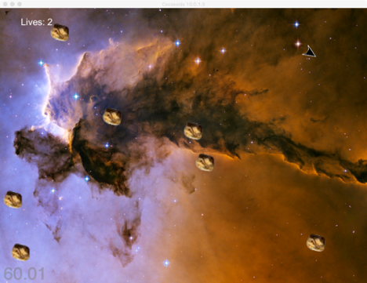

# Cocosoids

This is a simple Python 3 Cocos2D and PodSixNetbased multi=player networked "Asteroids" style game. It was created as a sample for Wight State University's "Game Programming" course that I teach.

Cocosoids-multi_python3 is identical to Cocosoids-single_python3 with the addition of client-server TCP/IP network multi-player based on PodSixNet. https://github.com/chr15m/PodSixNet The only changes needed for multiplayer-player are a grand total of 16 lines in Game.py and the addition of two files, GameChatClient.py and GameChatServer.py. The new files have "Chat" in their names because they consist of very minor changes from the example "Chat" client and server that come with PodSixNet.
